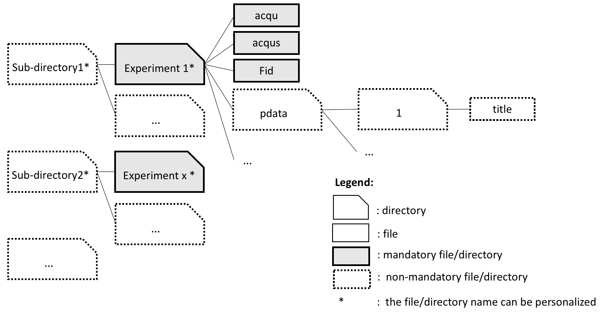

```{r setup, include = FALSE}
require(knitr)
knitr::opts_chunk$set(collapse = TRUE, comment = "#>",  fig.width = 10, fig.height = 6, fig.align = "center", tidy = TRUE, tidy.opts=list(width.cutoff=80), fig.keep = 'high', dpi=40)
```


```{r, include=FALSE}
# ==== set graphical parameters =================
# select the index of the spectrum that will be drawn
spectrIndex <- 1
# colors
col1 <-  "gray18"
col2 <- "firebrick1"
library(PepsNMR)

```


# Introduction

This document provides a brief summary on how to use the `r Biocpkg("PepsNMR")` package. In this package, pre-processing functions transform raw FID signals from 1H NMR spectroscopy into a set of interpretable spectra. 


# Installation


The `r Biocpkg("PepsNMR")` package is available on Bioconductor and can be installed via `BiocManager::install`:
```{r install1,  eval = FALSE, background = "#EFFBF5", highlight = TRUE}
if (!requireNamespace("BiocManager", quietly = TRUE))
  install.packages("BiocManager")
BiocManager::install("PepsNMR")
```

The package needs to be loaded once installed to be used:
```{r library,  eval = FALSE, background = "#EFFBF5", highlight = TRUE}
library(PepsNMR)
```

The package development version is available on Github: [https://github.com/ManonMartin/PepsNMR](https://github.com/ManonMartin/PepsNMR), although it is highly recommended to rely on the Bioconductor release version of the package to avoid any package version mismatch.


# Data importation

The first step is meant to access the raw data files. To import Free Induction Decays (FIDs) in Bruker format, use the `ReadFids` function. This function will return a list with the FID data matrix (saved in `Fid_data`) and metadata about these FIDs (saved in `Fid_info`).

```{r dataimport, eval = FALSE}
fidList <- ReadFids(file.path(path,dataset_name)) 

Fid_data <- fidList[["Fid_data"]]
Fid_info <- fidList[["Fid_info"]]
```


The possible directory structures are illustrated here:

```{r, fig.cap="Accepted directory structures for the raw Bruker files", echo=FALSE}

```


And is to be linked with the possible options of the `ReadFids` function:

1. If use of _title_ file and presence of sub-directories: set the FID Title line, `subdirs = TRUE`,  `dirs.names = FALSE`
2. If use of _title_ file and no sub-directories: set the FID Title line, `subdirs = FALSE`,  `dirs.names = FALSE`
3. If no use of _title_ file and presence of sub-directories: `subdirs = TRUE`,  `dirs.names = TRUE`
4. If no use of _title_ file and no sub-directories: `subdirs = FALSE`,  `dirs.names = TRUE`


# Pre-processing steps

Here is the recommended pre-processing workflow on the FIDs and the spectra once the raw data have been loaded in R:

```{r steps, echo=FALSE,  eval=TRUE}

Steps <- c("Group Delay Correction", 
           "Solvent Suppression",
           "Apodization",
           "Fourier Transform",
           "Zero Order Phase Correction",
           "Internal Referencing",
           "Baseline Correction",
           "Negative Values Zeroing",
           "Warping",
           "Window Selection",
           "Bucketing",
           "Region Removal",
           "Zone Aggregation",
           "Normalization")

StepsDescr <- c("Correct for the Bruker Group Delay.",
                "Remove the solvent signal from the FIDs.",
                "Increase the Signal-to-Noise ratio of the FIDs.",
                "Transform the FIDs into a spectrum and convert the frequency scale (Hz ->  ppm).",
                "Correct for the zero order phase dephasing.",
                "Calibrate the spectra with an internal reference compound. Referencing with an internal (e.g. TMSP at 0 ppm)",
                 "Remove the spectral baseline.",
                "Set negatives values to 0.",
                "Warp the spectra according to a reference spectrum.",
                "Select the informative part of the spectrum.",
                "Data reduction.",
                "Set a desired spectral region to 0.",
                "Aggregate a spectral region into a single peak.",
                "Normalize the spectra.")


StepsTable <- cbind(Steps = Steps, Description = StepsDescr)

kable(StepsTable, caption = "Pre-processing steps. They are presented in the suggested order.")
   
```

Information on each function is provided in R, (e.g. type `?ReadFids` in the R console) and methodological details are found in @Martin2018.


# Available datasets
Human serum (`HS`) and urine (`HU`) datasets are available as raw data (FIDs in Bruker format) and as (partially) pre-processed signals/spectra in the ad hoc `r Biocpkg("PepsNMRData")` package automatically installed with `r Biocpkg("PepsNMR")`.

Here are examples of available datasets:
```{r availdata}
library(PepsNMRData)
str(FidData_HU)

str(FinalSpectra_HS)
```

Information for each dataset is available, (e.g. enter `?FidData_HS` in the R Console).

# Demo of the pre-processing functions on the Human Serum dataset

## Load the data
Raw Bruker FIDs can be loaded from where `r Biocpkg("PepsNMRData")` has been intalled:
```{r}
data_path <-  system.file("extdata", package = "PepsNMRData")
dir(data_path)
```


## Read the FID data file


To import FIDs in Bruker format, the `ReadFids` function is used. This function will return a list with the FID data matrix (here saved as `Fid_data`) and information about these FIDs (here saved as `Fid_info`).


```{r}
# ==== read the FIDs and their metadata =================
fidList <- ReadFids(file.path(data_path, "HumanSerum"))
Fid_data0 <- fidList[["Fid_data"]]
Fid_info <- fidList[["Fid_info"]]
kable(head(Fid_info))
```


```{r FIGRawFID, echo = FALSE, out.width = '100%', fig.cap="Raw FID."}
time <- as.numeric(colnames(Fid_data0))*1000
plot(time, Re(Fid_data0[spectrIndex,]),type="l", col = col1, xlab=
       expression(paste("Time (", mu,"s)")), ylab = "Intensity", 
     main = "Raw FID (real part)", ylim = c(-1e6,2e5))

```


## Group Delay Correction

The Bruker's digital filter originally produces a Group Delay that is removed during this step.
```{r}
# ==== GroupDelayCorrection =================
Fid_data.GDC <- GroupDelayCorrection(Fid_data0, Fid_info)
```


```{r, echo = FALSE, fig.cap="Signal before and after the Group Delay removal.", out.width = '100%', fig.height=12}
par(mfrow=c(2,1))
plot(time[0:300], Re(Fid_data0[spectrIndex,0:300]),  
     type = "l", ylab = "Intensity", xlab="", 
     main = "FID with the Group Delay (real part - zoom)", col = col1)
plot(time[0:300], Re(Fid_data.GDC[spectrIndex,0:300]), 
     type="l", ylab = "Intensity", xlab=expression(paste("Time (", mu,"s)")), 
     main="FID after Group Delay removal (real part - zoom)", col = col1)
```


## Solvent Suppression

Pre-acquisition techniques for solvent suppression can be unsufficient to remove the solvent signal from the FIDs. `SolventSuppression` estimates and removes this residual solvent signal based on a Whittaker smoother.

```{r}
# ====  SolventSuppression =================
SS.res <- SolventSuppression(Fid_data.GDC, returnSolvent=TRUE)

Fid_data.SS <- SS.res[["Fid_data"]]
SolventRe <- SS.res[["SolventRe"]]

```


```{r, echo = FALSE, fig.cap="Signal before and after the Residual Solvent Removal.", out.width = '100%', fig.height=12}
par(mfrow=c(2,1))
plot(time[0:4000], Re(Fid_data.GDC[spectrIndex,0:4000]),  col=col1, 
     type="l", ylab = "Intensity", xlab="", 
     main="FID and solvent residuals signal (real part - zoom)")
lines(time[0:4000],SolventRe[spectrIndex,0:4000], col=col2 , lwd = 1.3)
legend("topright", bty = "n", legend = c(expression(paste("Estimated solvent residuals signal ", (italic(W)))), expression(paste("FID signal ", (italic(S))))), 
       col=c(col2, col1),  lty = 1)

plot(time[0:4000], Re(Fid_data.SS[1,0:4000]), col=col1, 
     type="l", ylab = "Intensity", xlab=expression(paste("Time (", mu,"s)")), 
     main="FID without solvent residuals signal (real part - zoom)")
lines(time[0:4000], rep(0, 4000), col=col2)
```


## Apodization

The apodization step increases the spectral Signal-to-Noise ratio by multiplying the FIDs by an appropriate factor (by default a negative exponential).


```{r}
# ==== Apodization =================
Fid_data.A <- Apodization(Fid_data.SS, Fid_info)

```

```{r, echo = FALSE, fig.cap="Signal before and after Apodization.", out.width = '100%', fig.height=12}
par(mfrow=c(2,1))
plot(time, Re(Fid_data.SS[spectrIndex,]),  col=col1, 
     type="l", ylab = "Intensity", xlab="", main="FID before Apodization")

plot(time, Re(Fid_data.A[spectrIndex,]), col=col1, 
     type="l", ylab = "Intensity", xlab=expression(paste("Time (", mu,"s)")), 
     main="FID after Apodization")
```

## Zero Filling

The zero filling adds 0 to the end of the FIDs to improve the visual representation of spectra.

```{r}
# ==== Zero Filling =================
Fid_data.ZF <- ZeroFilling(Fid_data.A, fn = ncol(Fid_data.A))

```

```{r}
par(mar=c(4,4,1.5,1), mfrow=c(2,1))
plot(time, Re(Fid_data.A[spectrIndex,]),  col=col1, 
     type="l", ylab = "Intensity", xlab="", main="FID before Zero Filling")

time <- as.numeric(colnames(Fid_data.ZF))*1000
plot(time, Re(Fid_data.ZF[spectrIndex,]), col=col1, 
     type="l", ylab = "Intensity", xlab=expression(paste("Time (", mu,"s)")), 
     main="FID after Zero Filling")


```


## FourierTransform

The Fourier Transform is applied to the FIDs to obtain spectra expressed in the frequency domain. The `FourierTransform` function further converts this frequency scale originally in hertz into parts per million (ppm).


```{r}
# ==== FourierTransform =================
RawSpect_data.FT <- FourierTransform(Fid_data.ZF, Fid_info)
```


```{r, echo = FALSE, fig.cap="Spectrum after FT.", out.width = '100%'}
plot(Re(RawSpect_data.FT[spectrIndex,]), col=col1, xaxt="n",
     type="l", ylab = "Intensity", xlab = "ppm", 
     main="Spectrum after Fourier Transform")
at <- seq(1,dim(RawSpect_data.FT)[2], floor(dim(RawSpect_data.FT)[2]/10))
axis(side=1, at = at, 
     labels = round(as.numeric(colnames(RawSpect_data.FT)[at]),2))
```


## Zero Order Phase Correction

After Fourier Transform, the spectra need to be phased for the real part to be in pure absoptive mode (i.e. with positive intensities).

```{r}
# ==== ZeroOrderPhaseCorrection =================
Spectrum_data.ZOPC <- ZeroOrderPhaseCorrection(RawSpect_data.FT)
```


```{r, echo = FALSE, fig.cap="Spectrum after Zero Order Phase Correction.", out.width = '100%'}
plot(Re(Spectrum_data.ZOPC[spectrIndex,]), col=col1, xaxt="n",
     type="l", ylab = "Intensity", xlab = "ppm", 
     main="Spectrum after Zero Order Phase Correction")
at <- seq(1,dim(Spectrum_data.ZOPC)[2], floor(dim(Spectrum_data.ZOPC)[2]/10))
axis(side=1, at = at, 
     labels = round(as.numeric(colnames(Spectrum_data.ZOPC)[at]),2))
```


## Internal Referencing

During this step, the spectra are aligned with an internal reference compound (e.g. with the TMSP). The user determines the ppm value of the reference compound which is by default 0. 

```{r}
# ==== InternalReferencing =================
target.value <- 0
Spectrum_data.IR <- InternalReferencing(Spectrum_data.ZOPC, Fid_info,
                                        ppm.value = target.value)

```


```{r, echo = FALSE, fig.cap="Spectrum after Internal Referencing.", out.width = '100%'}

ppmvalues <- as.numeric(colnames(Spectrum_data.IR))
plot(Re(Spectrum_data.IR[spectrIndex,]), col=col1, xaxt="n",
     type="l", ylab = "Intensity", xlab = "ppm", 
     main="Spectrum after internal referencing")
at <- seq(1,dim(Spectrum_data.IR)[2], floor(dim(Spectrum_data.IR)[2]/10))
axis(side=1, at = at, 
     labels = round(ppmvalues[at],2))

index <- which(abs(ppmvalues-target.value) == min(abs(ppmvalues-target.value)))
abline(v = index, col= col2)
legend("topright", bty = "n", legend = "Peak location", 
       col=col2,  lty = 1)
```


## Baseline Correction

The spectral baseline is estimated and removed from the spectral profiles with the Asymetric Least Squares smoothing algorithm.


```{r}
# ==== BaselineCorrection =================
BC.res <- BaselineCorrection(Spectrum_data.IR, returnBaseline = TRUE,
                             lambda.bc = 1e8, p.bc = 0.01)

```


```{r, echo = FALSE, fig.cap="Spectrum before and after the Baseline Correction.", out.width = '100%', fig.height=12}
par(mfrow=c(2,1))
Spectrum_data.BC <- BC.res[["Spectrum_data"]] 
Baseline <- BC.res[["Baseline"]]


plot(Re(Spectrum_data.IR[spectrIndex,]), col=col1, xaxt="n",
     type="l", ylab = "Intensity", xlab = "", 
     main="Spectrum before Baseline Correction")
at <- seq(1,dim(Spectrum_data.IR)[2], floor(dim(Spectrum_data.IR)[2]/10))
axis(side=1, at = at, labels = round(ppmvalues[at],2))
lines(Baseline[,1], col=col2)
legend("topright", bty = "n", legend = "Estimated baseline ", 
       col = col2,  lty = 1)

plot(Re(Spectrum_data.BC[spectrIndex,]), col=col1, xaxt="n",
     type="l", ylab = "Intensity", xlab = "ppm", 
     main="Spectrum after Baseline Correction")
axis(side=1, at = at, labels = round(ppmvalues[at],2))
```


## Negative Values Zeroing

The remaining negative values are set to 0 since they cannot be interpreted.
```{r NVZ}
# ==== NegativeValuesZeroing =================
Spectrum_data.NVZ <- NegativeValuesZeroing(Spectrum_data.BC)
```

```{r, echo = FALSE, fig.cap="Spectrum after Negative Values Zeroing.", out.width = '100%'}

plot(Re(Spectrum_data.NVZ[spectrIndex,]), col=col1, xaxt="n",
     type="l", ylab = "Intensity", xlab = "ppm", 
     main="Spectrum after Negative Values Zeroing")
axis(side=1, at = at, labels = round(ppmvalues[at],2))
```


## Warping

The spectra are realigned based on a reference spectrum with a Semi-Parametric Time Warping technique.


```{r}
# ==== Warping =================
W.res <- Warping(Spectrum_data.NVZ, returnWarpFunc = TRUE, 
                 reference.choice = "fixed")

Spectrum_data.W <- W.res[["Spectrum_data"]]
warp_func <- W.res[["Warp.func"]]
```


```{r, echo = FALSE, fig.cap="Spectrum before and after the Baseline Correction.", out.width = '100%', fig.height=12}
par(mfrow=c(2,1))

f <- c(21, 20, 24) # warped spectra index to draw
fen <- c(17780:18240) # x-window
ylim <- c(0, max(c(Re(Spectrum_data.NVZ[c(1, f),fen]), Re(Spectrum_data.W[c(spectrIndex, f),fen]))))

# Unwarped spectra
plot(Re(Spectrum_data.NVZ[1, fen]),   xaxt = "n", col=col2, ylab = "Intensity",ylim=ylim, type="l", xlab="ppm", main="Spectra before warping (real part - zoom)")
legend("topright", bty = "n", y.intersp = 0.8,legend=c("Unwarped spectra","Ref. spectrum "), lty = c(1,1), col=c(col1,col2))    
axis(side=1,  at = seq(1,length(fen), 114), labels = round(as.numeric(colnames(Spectrum_data.NVZ[,fen])[seq(1,length(fen), 114)]),2))
for (j in f) {
  graphics::lines(Re(Spectrum_data.NVZ[j,fen]), col=col1, type="l")
  }

# Warped spectra
plot(Re(Spectrum_data.W[1, fen]), col=col2, xaxt = "n",ylab = "Intensity",ylim=ylim, type="l", xlab="ppm", main="Warped spectra (real part - zoom)")
legend("topright",   bty = "n",  y.intersp = 0.8, legend=c("Warped spectra ","Ref. spectrum "), lty = c(1,1), col=c(col1,col2))    
axis(side=1,  at = seq(1,length(fen), 114), labels = round(as.numeric(colnames(Spectrum_data.NVZ[,fen])[seq(1,length(fen), 114)]),2))
for (j in f) {
  graphics::lines(Re(Spectrum_data.W[j,fen]), col=col1, type="l")
  }
```


## Window Selection

During this step the user selects the part of the spectrum that is of interest and the other parts are removed from the spectral matrix.
```{r}
# ==== WindowSelection =================
Spectrum_data.WS <- WindowSelection(Spectrum_data.W, from.ws = 10, to.ws = 0.2)
```


```{r, echo = FALSE, fig.cap="Spectrum after Window Selection.", out.width = '100%'}

at <- seq(1,dim(Spectrum_data.WS)[2], floor(dim(Spectrum_data.WS)[2]/10))
ppmvalues <- as.numeric(colnames(Spectrum_data.WS))
plot(Re(Spectrum_data.WS[spectrIndex,]), col = col1, xaxt = "n",
     type = "l", ylab = "Intensity", xlab = "ppm", 
     main = "Spectrum after Window Selection")
axis(side = 1, at = at, labels = round(ppmvalues[at],2))
```


## Bucketing

The `Bucketing` function reduces the number of spectral descriptors by aggregating intensities into a series of buckets.

```{r}
# ==== Bucketing =================
Spectrum_data.B <- Bucketing(Spectrum_data.WS, intmeth = "t")
```


```{r, echo = FALSE, fig.cap="Spectrum before and after Bucketing.", out.width = '100%', fig.height=12}
par(mfrow=c(2,1))

at <- seq(1,dim(Spectrum_data.WS)[2], floor(dim(Spectrum_data.WS)[2]/10))
ppmvalues <- as.numeric(colnames(Spectrum_data.WS))
plot(Re(Spectrum_data.WS[spectrIndex,]), col = col1, xaxt = "n",
     type = "l", ylab = "Intensity", xlab = "", 
     main = "Spectrum before Bucketing")
axis(side = 1, at = at, labels = round(ppmvalues[at],2))

at <- seq(1,dim(Spectrum_data.B)[2], floor(dim(Spectrum_data.B)[2]/10))
ppmvalues <- as.numeric(colnames(Spectrum_data.B))
plot(Re(Spectrum_data.B[spectrIndex,]), col = col1, xaxt = "n",
     type = "l", ylab = "Intensity", xlab = "ppm", 
     main = "Spectrum after Bucketing")
axis(side = 1, at = at, labels = round(ppmvalues[at],2))
```


## Region Removal

By default, this step sets to zero spectral areas that are of no interest or have a sigificant and unwanted amount of variation (e.g. the water area).

```{r}
# ==== RegionRemoval =================
Spectrum_data.RR <- RegionRemoval(Spectrum_data.B, typeofspectra = "serum")
```

```{r, echo = FALSE, fig.cap="Spectrum after Region Removal", out.width = '100%'}

plot(Re(Spectrum_data.RR[spectrIndex,]), col = col1, xaxt = "n",
     type = "l", ylab = "Intensity", xlab = "ppm", 
     main = "Spectrum after Region Removal")
axis(side = 1, at = at, labels = round(ppmvalues[at],2))
```

## Normalization

The normalization copes with the dilution factor and other issues that render the spectral profiles non-comparable to each other.

```{r}
# ==== Normalization =================
Spectrum_data.N <- Normalization(Spectrum_data.RR, type.norm = "mean")
```


```{r, echo = FALSE, fig.cap="Spectrum before and after Normalization", out.width = '100%', fig.height=12}
par(mfrow=c(2,1))


plot(Re(Spectrum_data.RR[spectrIndex,]), col = col1, xaxt = "n",
     type = "l", ylab = "Intensity", xlab = "ppm", 
     main = "Spectrum before Normalization")
axis(side = 1, at = at, labels = round(ppmvalues[at],2))
lines(Re(Spectrum_data.RR[2,]), col = "blue")
lines(Re(Spectrum_data.RR[3,]), col = "green")

plot(Re(Spectrum_data.N[spectrIndex,]), col = col1, xaxt = "n",
     type = "l", ylab = "Intensity", xlab = "ppm", 
     main = "Spectrum after Normalization")
axis(side = 1, at = at, labels = round(ppmvalues[at],2))
lines(Re(Spectrum_data.N[2,]), col = "blue")
lines(Re(Spectrum_data.N[3,]), col = "green")
```

Note: the function `ZoneAggregation` is not used here, but is can be applied e.g. to urine spectra to aggregate the citrate peak.

# Final spectra visualisation 

The `Draw` function enables to produce line plots with `type.draw = "signal"` or PCA results with `type.draw = "pca"` of FIDs or spectra. These plots can be saved as pdf files with the option `output = "pdf"`, see `?Draw`, `?DrawSignal` and `?DrawPCA` for more details on the other available options.

```{r, fig.height=7, fig.width=8, out.width='100%', fig.cap = "4 first pre-processed spectra"}
Draw(Spectrum_data.N[1:4,], type.draw = c("signal"), subtype= "stacked", output = c("default"))
```


```{r, fig.height=6, fig.width=8, out.width='100%', fig.cap = "PCA scores of the pre-processed spectra"}
Draw(Spectrum_data.N, type.draw = c("pca"), output = c("default"), 
     Class = Group_HS, type.pca = "scores")
```


```{r, out.width='100%', out.width='70%', out.width='100%', fig.cap = "PCA loadings of the pre-processed spectra"}
Draw(Spectrum_data.N, type.draw = c("pca"), output = c("default"), 
     Class = Group_HS, type.pca = "loadings")
```


# Session info
```{r}
sessionInfo()
```

# References

